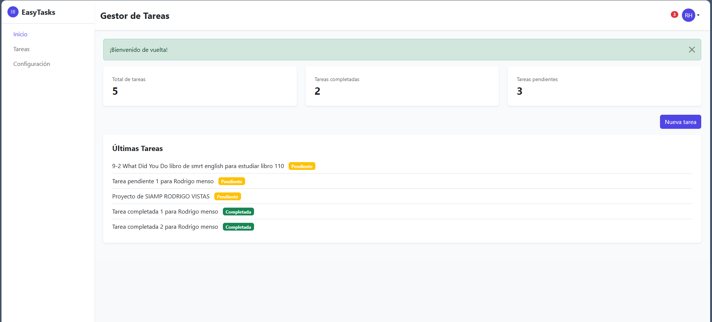
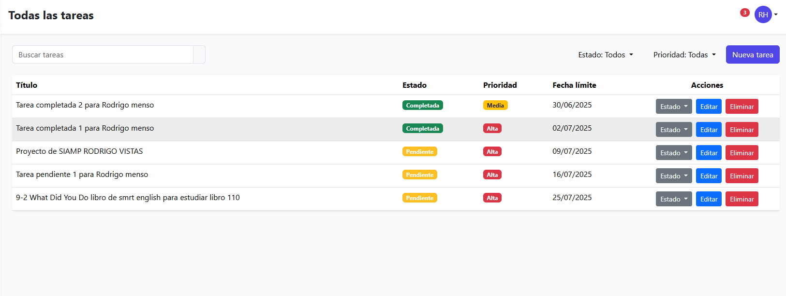

<p align="center"></p>

<h1 align="center">EasyTasks - Gestor de Actividades</h1>

<p align="center">
Una aplicación web para gestionar tareas y actividades diarias de manera eficiente
</p>

## Acerca de EasyTasks

EasyTasks es una aplicación de gestión de tareas construida con Laravel que permite a los usuarios:

- Crear, editar y eliminar tareas
- Categorizar y priorizar actividades
- Realizar seguimiento del progreso
- Establecer fechas límite y recordatorios
- Gestionar el tiempo de manera eficiente

## Instalación

1. Clona el repositorio
   ```
   git clone https://github.com/tu-usuario/gestor-de-actividades.git
   cd gestor-de-actividades
   ```

2. Instala las dependencias
   ```
   composer install
   npm install && npm run dev
   ```

3. Configura el entorno
   ```
   cp .env.example .env
   php artisan key:generate
   ```

4. Configura la base de datos en el archivo `.env`
   ```
   DB_CONNECTION=mysql
   DB_HOST=127.0.0.1
   DB_PORT=3306
   DB_DATABASE=gestor_actividades
   DB_USERNAME=root
   DB_PASSWORD=
   ```

5. Ejecuta las migraciones
   ```
   php artisan migrate
   ```

6. Inicia el servidor
   ```
   php artisan serve
   ```

## Capturas de pantalla

### Página de bienvenida


### Dashboard


### Lista de tareas



## Tecnologías utilizadas

- **Laravel**: Framework PHP para el backend
- **Bootstrap 5**: Framework CSS para el frontend
- **MySQL**: Base de datos relacional
- **JavaScript/jQuery**: Para interacciones dinámicas

## Estructura del proyecto

- `/app`: Contiene los modelos, controladores y lógica de negocio
- `/resources/views`: Plantillas Blade para la interfaz de usuario
- `/routes`: Definición de rutas
- `/database/migrations`: Migraciones para la estructura de la base de datos

## License

The Laravel framework is open-sourced software licensed under the [MIT license](https://opensource.org/licenses/MIT).
