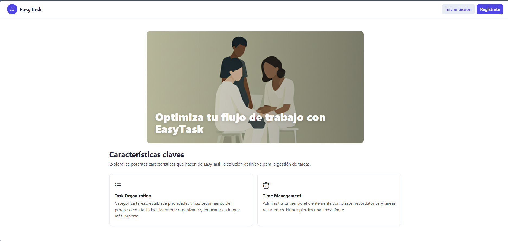

<p align="center"></p>

<h1 align="center">EasyTasks - Gestor de Actividades</h1>

<p align="center">
Una aplicación web para gestionar tareas y actividades diarias de manera eficiente
</p>

## Acerca de EasyTasks

EasyTasks es una aplicación de gestión de tareas construida con Laravel que permite a los usuarios:

- Crear, editar y eliminar tareas
- Categorizar y priorizar actividades
- Realizar seguimiento del progreso
- Establecer fechas límite y recordatorios
- Gestionar el tiempo de manera eficiente

## Instalación

1. Clona el repositorio
   ```
   git clone https://github.com/tu-usuario/gestor-de-actividades.git
   cd gestor-de-actividades
   ```

2. Instala las dependencias
   ```
   composer install
   npm install && npm run dev
   ```

3. Configura el entorno
   ```
   cp .env.example .env
   php artisan key:generate
   ```

4. Configura la base de datos en el archivo `.env`
   ```
   DB_CONNECTION=mysql
   DB_HOST=127.0.0.1
   DB_PORT=3306
   DB_DATABASE=gestor_actividades
   DB_USERNAME=root
   DB_PASSWORD=
   ```

5. Ejecuta las migraciones
   ```
   php artisan migrate
   ```

6. Inicia el servidor
   ```
   php artisan serve
   ```

## Capturas de pantalla

### Página de bienvenida


### Dashboard


### Lista de tareas


## Tecnologías utilizadas

- **Laravel**: Framework PHP para el backend
- **Bootstrap 5**: Framework CSS para el frontend
- **MySQL**: Base de datos relacional
- **JavaScript/jQuery**: Para interacciones dinámicas

## Estructura del proyecto

- `/app`: Contiene los modelos, controladores y lógica de negocio
- `/resources/views`: Plantillas Blade para la interfaz de usuario
- `/routes`: Definición de rutas
- `/database/migrations`: Migraciones para la estructura de la base de datos

## Contribuir

Las contribuciones son bienvenidas. Para contribuir:

1. Haz un fork del proyecto
2. Crea una rama para tu funcionalidad (`git checkout -b feature/amazing-feature`)
3. Haz commit de tus cambios (`git commit -m 'Add some amazing feature'`)
4. Push a la rama (`git push origin feature/amazing-feature`)
5. Abre un Pull Request

Laravel is accessible, powerful, and provides tools required for large, robust applications.

## Learning Laravel

Laravel has the most extensive and thorough [documentation](https://laravel.com/docs) and video tutorial library of all modern web application frameworks, making it a breeze to get started with the framework.

You may also try the [Laravel Bootcamp](https://bootcamp.laravel.com), where you will be guided through building a modern Laravel application from scratch.

If you don't feel like reading, [Laracasts](https://laracasts.com) can help. Laracasts contains thousands of video tutorials on a range of topics including Laravel, modern PHP, unit testing, and JavaScript. Boost your skills by digging into our comprehensive video library.

## Laravel Sponsors

We would like to extend our thanks to the following sponsors for funding Laravel development. If you are interested in becoming a sponsor, please visit the [Laravel Partners program](https://partners.laravel.com).

### Premium Partners

- **[Vehikl](https://vehikl.com)**
- **[Tighten Co.](https://tighten.co)**
- **[Kirschbaum Development Group](https://kirschbaumdevelopment.com)**
- **[64 Robots](https://64robots.com)**
- **[Curotec](https://www.curotec.com/services/technologies/laravel)**
- **[DevSquad](https://devsquad.com/hire-laravel-developers)**
- **[Redberry](https://redberry.international/laravel-development)**
- **[Active Logic](https://activelogic.com)**

## Contributing

Thank you for considering contributing to the Laravel framework! The contribution guide can be found in the [Laravel documentation](https://laravel.com/docs/contributions).

## Code of Conduct

In order to ensure that the Laravel community is welcoming to all, please review and abide by the [Code of Conduct](https://laravel.com/docs/contributions#code-of-conduct).

## Security Vulnerabilities

If you discover a security vulnerability within Laravel, please send an e-mail to Taylor Otwell via [taylor@laravel.com](mailto:taylor@laravel.com). All security vulnerabilities will be promptly addressed.

## License

The Laravel framework is open-sourced software licensed under the [MIT license](https://opensource.org/licenses/MIT).
